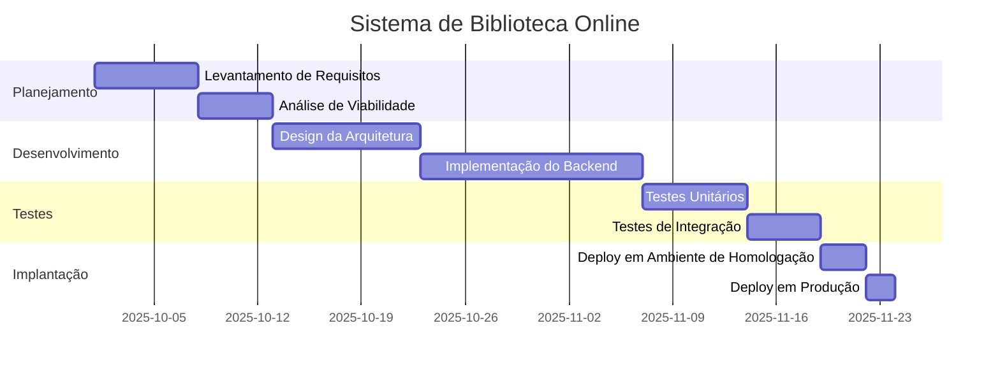

# replenishment-activity-gaps

# Gantt

```mermaid
gantt
  title Sistema de Biblioteca Online
  dateFormat YYYY-MM-DD

  section Planejamento
    Levantamento de Requisitos       : a1, 2025-10-01, 7d
    Análise de Viabilidade           : a2, after a1, 5d

  section Desenvolvimento
    Design da Arquitetura            : a3, after a2, 10d
    Implementação do Backend         : a4, after a3, 15d

  section Testes
    Testes Unitários                 : a5, after a4, 7d
    Testes de Integração             : a6, after a5, 5d

  section Implantação
    Deploy em Ambiente de Homologação: a7, after a6, 3d
    Deploy em Produção               : a8, after a7, 2d
```
